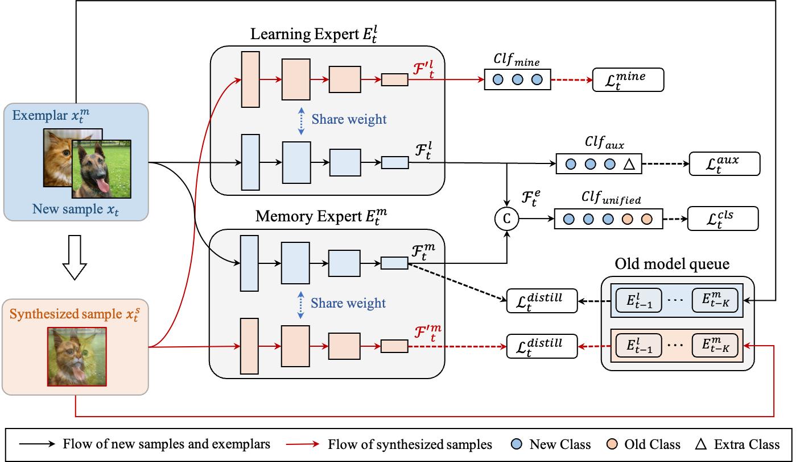

# ISM-Net: Mining incremental semantics for class incremental learning




**Errata: The correct version of Figure 3 in the paper is shown above.**
## Usage

```
python main.py --config='select config from ./exps'
```

## Acknowledgment

We thank to this repo(https://github.com/G-U-N/PyCIL) for the base code framework.

## Citation
Please cite our paper if you find the work useful:

@article{qiu2022ism,
  title={ISM-Net: Mining incremental semantics for class incremental learning},
  author={Qiu, Zihuan and Xu, Linfeng and Wang, Zhichuan and Wu, Qingbo and Meng, Fanman and Li, Hongliang},
  journal={Neurocomputing},
  year={2022},
  publisher={Elsevier}
}
