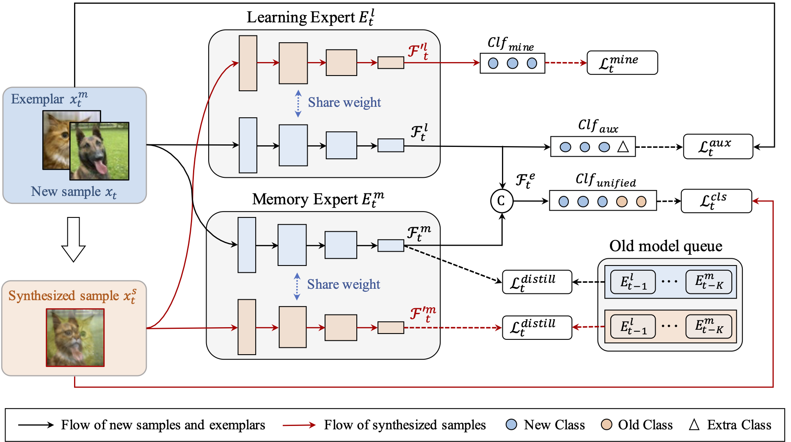

# ISM-Net: Mining incremental semantics for class incremental learning



## Usage

```
python main.py --config='select config from ./exps'
```

## Acknowledgment

We thank to this repo(https://github.com/G-U-N/PyCIL) for the base code framework.
